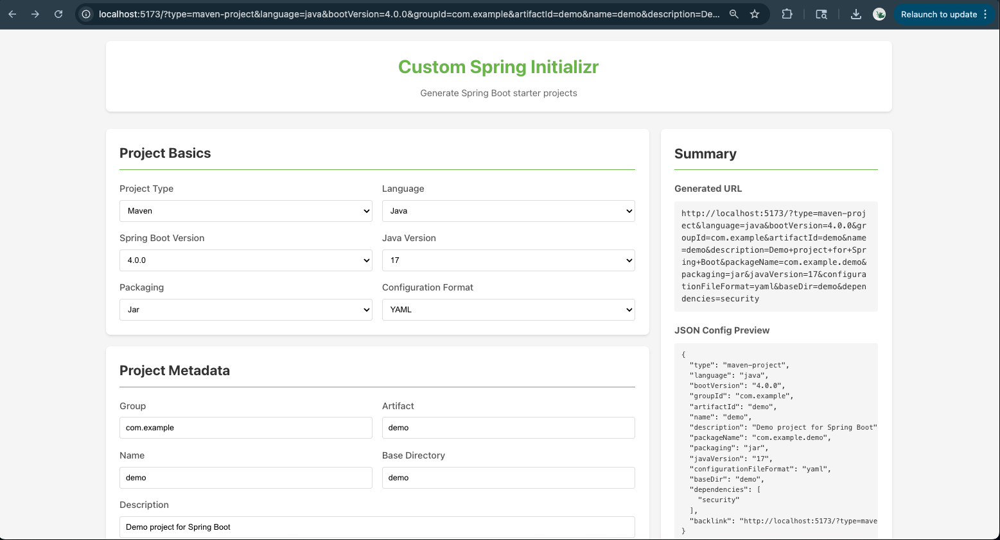
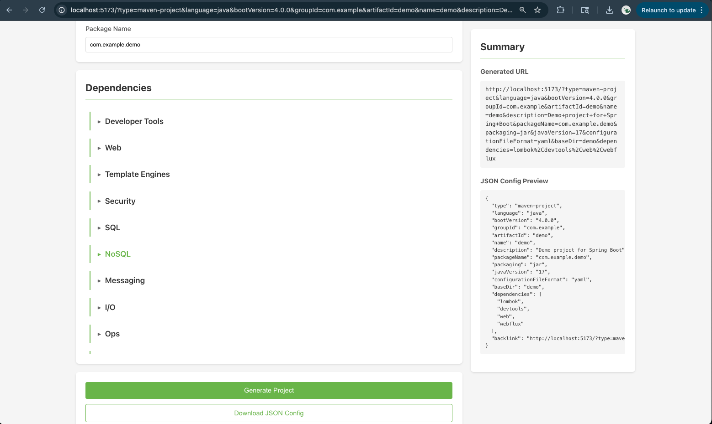

# Custom Spring Initializr Web UI

## Overview
A React-based Spring Initializr client that fetches live metadata from https://start.spring.io to generate Spring Boot starter projects. Users can configure project settings, preview the generated URL, download the ZIP, and export a shareable JSON config with a deep link to recreate the same setup.

## Screenshot



## Key Benefits
- Dynamic UI driven by Initializr metadata
- Generates Spring Boot starter ZIP via query parameters
- Exports configuration as a downloadable JSON file
- Backlink support to restore saved project options
- URL-synced form for sharing reproducible templates

## Workflow
1) Fetch metadata
- UI requests options from `http://localhost:8080/api/initializr/metadata` (Accept: `application/vnd.initializr.v2.3+json`). This endpoint proxies Spring Initializr.

2) Render dynamic form
- Display available options (Boot version, dependencies, etc.) from metadata.

3) Configure project
- User selects name, groupId, version, dependencies, etc. The browser URL updates with query params.

4) Generate & download
- On Generate, UI builds a URL and triggers a ZIP download: `http://localhost:8080/api/initializr/starter.zip?...` (Accept: `application/vnd.initializr.v2.3+json`). Proxied to Initializr.

5) Export JSON config
- UI generates a JSON blueprint including a backlink (deep link) for later reuse.

6) Restore from backlink
- Opening the backlink pre-fills the UI with the same configuration.

## ⚙️ System Workflow
1) Fetches live metadata: UI → calls Proxy `/api/initializr/metadata` → Proxy → requests metadata from `start.spring.io` → Proxy returns options back to UI → UI renders dynamic form.
2) ZIP generation: UI → builds query params → calls Proxy `/api/initializr/starter.zip?...` → Proxy forwards to https://lnkd.in/eTEFNRDp → ZIP file returned → UI downloads it.
3) JSON config export: UI → generates JSON blueprint locally (including backlink) → user saves file via browser file picker → file can later restore full configuration via deep link.

## APIs & Contracts
Note: The app uses a proxy on `localhost:8080`. Ensure it runs before the UI.

### Metadata API
- Endpoint: `GET http://localhost:8080/api/initializr/metadata`
- Headers:
  - Accept: `application/vnd.initializr.v2.3+json`
- Returns: options for project type, language, packaging, Boot versions, Java versions, dependencies, etc.

### ZIP Generator API
- Endpoint: `GET http://localhost:8080/api/initializr/starter.zip`
- Headers:
  - Accept: `application/vnd.initializr.v2.3+json`
- Query example:
  ```text
  type=maven-project
  &language=java
  &bootVersion=3.4.1
  &baseDir=demo
  &groupId=com.example
  &artifactId=demo
  &name=demo
  &description=Demo%20project
  &packageName=com.example.demo
  &packaging=jar
  &javaVersion=17
  &configurationFileFormat=yaml
  &dependencies=web,data-jpa
  ```

## Functional Requirements

### Load metadata on app start
- Fetch metadata from the proxy and handle loading/error states.

### Render dynamic form
- Dropdowns for Project Type, Language, Boot Version, Packaging, Java Version, Configuration Format
- Text inputs for groupId, artifactId, name, description, baseDir, packageName
- Dependency picker with categories and multi-select (stores codes like `web`, `data-jpa`)

### URL synchronization
- Path: `/starter-client`
- Query params mirror all form fields (`type`, `language`, `bootVersion`, `groupId`, `packageName`, `dependencies`, ...)
- First load: parse query params and pre-fill the form
- On change: update query params (via router/navigation) without reload

### Generate project
- On Generate:
  1. Build query string from form state
  2. Construct ZIP URL: `http://localhost:8080/api/initializr/starter.zip?${queryString}`
  3. Trigger download via anchor click or fetch→blob→ObjectURL

### JSON config
- Provide a Download JSON action that saves the current config and a backlink.
  Example:
  ```json
  {
    "type": "maven-project",
    "language": "java",
    "bootVersion": "3.4.2",
    "name": "orders-service",
    "configurationFileFormat": "yaml",
    "dependencies": ["web", "data-jpa"],
    "groupId": "com.example",
    "artifactId": "orders-service",
    "packageName": "com.example.orders",
    "javaVersion": "17",
    "packaging": "jar",
    "baseDir": "orders-service",
    "description": "Orders service project",
    "backlink": "http://localhost:3000/starter-client?type=maven-project&language=java&bootVersion=3.4.2&..."
  }
  ```

### Backlink behavior
- When opened, the app parses query params, pre-fills the form, and is ready to re-generate.

## Non‑Functional Requirements
- Responsiveness: clean layout on common desktop sizes
- Performance: fetch metadata once and cache in state
- Resilience: handle fetch errors; validate required fields before enabling Generate
- Code quality: modular React components; clear types/interfaces (TypeScript preferred)

## Dependencies

### Runtime
- react (^18.2.0)
- react-dom (^18.2.0)
- react-router-dom (^6.20.0)

### Dev
- typescript (^5.2.2)
- vite (^5.0.8)
- @vitejs/plugin-react (^4.2.1)
- @types/react (^18.2.43)
- @types/react-dom (^18.2.17)
- eslint (^8.55.0)
- @typescript-eslint/parser (^6.14.0)
- @typescript-eslint/eslint-plugin (^6.14.0)
- eslint-plugin-react-hooks (^4.6.0)
- eslint-plugin-react-refresh (^0.4.5)

## Run Locally

### Prerequisites
- Node.js 18+
- npm (or yarn)

### 1) Start the proxy server
The UI expects a proxy on `localhost:8080` handling:
- `GET /api/initializr/metadata` → proxies Spring Initializr metadata
- `GET /api/initializr/starter.zip?params` → proxies ZIP generation

### 2) Install dependencies
```bash
cd custom-initializr
npm install
```

### 3) Start the dev server
```bash
npm run dev
```

You should see output similar to:
```
VITE v5.0.8  ready in 500 ms

➜  Local:   http://localhost:5173/
➜  Network: use --host to expose
```

Open http://localhost:5173 (or the URL shown in the terminal). The app reloads automatically on changes.

### 4) Routes
- Main: http://localhost:5173/starter-client
- Root: http://localhost:5173/

## Scripts

### Develop
```bash
npm run dev
```

### Build
```bash
npm run build
```

### Preview
```bash
npm run preview
```

### Lint
```bash
npm run lint
```

## Troubleshooting

Port in use
- Vite tries the next available port; check terminal output.

Install issues
- Verify Node.js 18+: `node --version`
- Remove `node_modules` and `package-lock.json`, then `npm install`
- Clear cache: `npm cache clean --force`

TypeScript errors
- Run `npm run build` to see compilation errors
- Ensure all deps are installed: `npm install`

Proxy not running
- Start proxy on `localhost:8080`
- Check endpoints:
  - `http://localhost:8080/api/initializr/metadata`
  - `http://localhost:8080/api/initializr/starter.zip`
- The UI shows an error if it cannot connect

CORS
- Ensure the proxy sets the correct CORS headers
